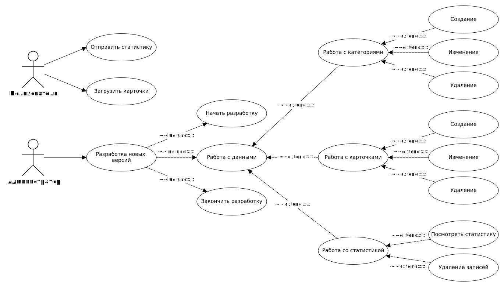
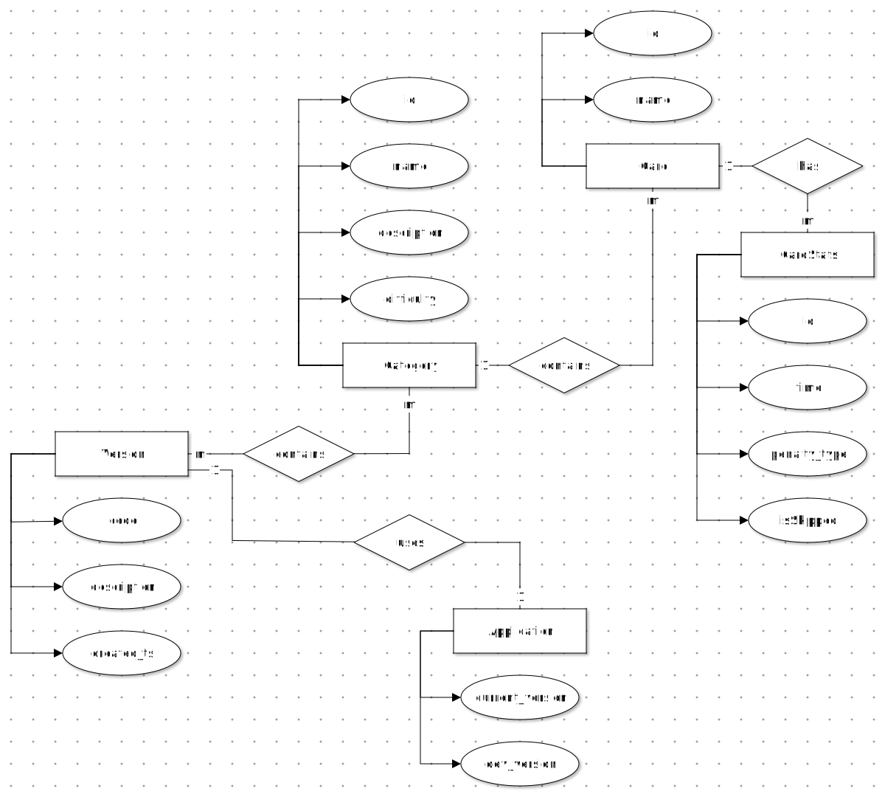
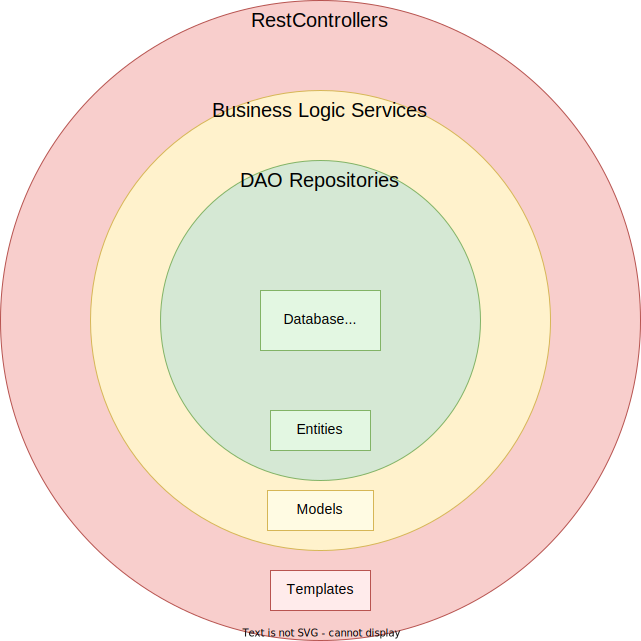

# Название проекта
Vary-backend

# Краткое описание идеи проекта
Бэкэнд приложение для игры Vary. Командная игра на отгадывание слов - карточек. Первый этап - объяснение карточек словами, второй - жестами, заключительный - одним словом.

# Краткое описание предметной области
**Предметная область** - настольные игры для больших и не очень компаний (от 4 человек), связанные с объяснением слов.

**Карточка** - слово/словосочетание, которое игрок должен объяснить своей команде.

**Категория карточек** - набор карточек, объединенных по некоторому общему признаку.

**Режим игры** - один из трех способов объяснения карточек:
- **"Объясни словами"** - без использования однокоренных слов и переводов на другие языки
- **"Покажи жестами"** - без звуков и указаний на отдельные предметы
- **"Объяснить одним словом"**

**Общее последнее слово** - событие, начинающееся по истечении выделенного для раунда веремни, при котором карточку отгадывать могут все команды.

**Штраф за пропуск** - наказание, которое несет игрок при отказе от объяснения слова на карточке.

**Балл** - каждая отгаданная командой карточка.

**Результат** - количество баллов, набранных командами.

**Победитель** - команда, набравшая больше всех баллов по результату игры.

**Backend приложение** для игры необходимо для хранения информации о пользователях с их привелегиями, предоставления пользователям персональных комплектов слов-карточек для игры и хранения статистики о сыгранных карточках.

# Краткий анализ аналогичных решений
Критерий                        | Alias | Крокодил  | Ассоциации    | Vary
--------------------------------|-------|-----------|---------------|---------
наличие мобильного приложения   | Есть  | Есть      | Нет           | Есть
деление на команды              | Есть  | Есть      | Нет           | Есть
действия игрока                 | объяснение словами / отгадывание  | объяснение жестами / отгадывание | объяснение словами / отгадывание | объяснение словами / жестами / одним словом / отгадывание / запоминание

# Краткое обоснование целесообразности и актуальности проекта
Данный проект актуален благодаря внесению новизны в существующие решения; помимо улучшению коммуникативных навыков способствует тренировке памяти и гибкости мышления.
Одна из целей проекта - учебная - заключается в получении опыта в разработке backend-приложений для последующего возможного трудоустройства на должность backend-разработчика.
Проект актуален, поскольку в текущий промежуток времени коллегами ведется разработка android-приложения Vary, которому необходим backend.

# Use-case диаграмма

# ER-диаграмма сущностей

# Архитектурные характеристики, важные для проекта
- расширяемость;
- быстродействие;
- обеспечить возможность быстрой установки backend-приложения на любом устройстве (вне зависимости от версии операционной системы).

# 1. Описание типа приложения и выбранного технологического стека

Тип приложения - backend application.

- [Spring boot](https://spring.io/projects/spring-boot)
- [Postgresql](https://www.postgresql.org/)
- [Flyway](https://flywaydb.org/) (Миграции БД)
- [Docker](https://www.docker.com/) (Развертывание приложения)

# 2. Верхнеуровневое разбиение на компоненты

- Доступ к данным – репозитории, реализованные с помощью компонента Database из [ebean-spring](https://ebean.io/)
- Бизнес-логика – Spring Boot Beans, @Service
- Реализация UI – десктоп приложение, [Compose by JetBrains](https://www.jetbrains.com/ru-ru/lp/compose-mpp/)

# 3. UML-диаграмма для двух отдельных компонентов (доступ к данным, бизнес-логика)

UML-диаграмма классов:

# 4. UML-диаграмма "модельных" классов сущностей

UML-диаграмма классов сущностей (в будущем может уточняться):

